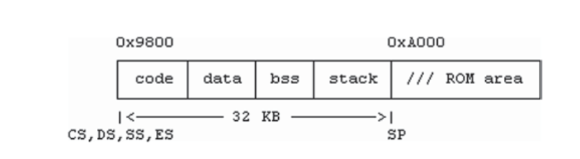

## 开发引导程序
### 引导程序要求

- 引导程序需要汇编代码
- 编译链接程序bcc(16位代码)，gcc(32或64位代码)
- 在执行期间，cpu的CS,DS,SS寄存器必须全部指向程序中的同一个段
- 引导程序大小极其受限，512或1024字节，为了能匹配磁盘的一个或两个扇区
    - 引导程序的第一个512字节被加载到0x07C00
    - 如果引导程序大于512字节，它必须自己加载缺失的部分
    - 如果引导程序的内存首部也是操作系统需要的，则必须将其移动到其他位置，以便其不被传入的操作系统镜像破坏
    - 引导程序必须管理自己的执行环节，如：建立cpu段寄存器和建立一个栈

- 引导程序不能用标准I/O库函数，如果需要使用，则需要自己实现
- 开发引导程序几乎没有工具可调试，如果出错，机器将简单宕机


### 在线和离线引导程序

#### 从FD扇区引导系统
FD磁盘包含一个引导程序在0扇区，紧接着是操作系统内核镜像，

```
as86 -o bs.o bs.s
bcc -c -ansi bc.c
#link bs.o and bc.o into a binary executable without header
ld86 -d -o booter bs.o bc.o /usr/lib/bcc/libc.a
# dump booter to sector 0 of a FD
dd if=booter of=/dev/fd0 bs=512 count=1 conv=notrunc
```
- if=输入
- of输出
- conv=notrunc 为了防止dd截断镜像文件

当然也可以将上述命令写入shell脚本中，或者Makefile文件中进行自动构建

以下为引导文件booter的汇编代码，bs.s
```assembler
!============================ bs.s file ================================
.globl _main,_prints,_NSEC                       ! IMPORT from C
.globl _getc,_putc,_readfd,_setes,_inces,_error   ! EXPORT to C
    BOOTSEG     = 0x9800    ! booter segment
    OSSEG       = 0x1000    ! jfos kernel segment
    SSP         = 32*1024   ! booter stack size=32KB
    BSECTORS    = 2         ! number of sectors to load initially
! Boot SECTOR loaded at (0000:7C00). reload booter to segment 0x9800
start:
    mov     ax, #BOOTSEG    ! set ES to 0x9800
    mov     es, ax
! call BIOS INT13 to load BSECTORS to (segment,offset)=(0x9800,0)
    xor     dx, dx          ! dh=head=0, dl=drive=0
    xor     cx, cx          ! ch=cyl=0, cl=sector=0
    incb    cl              ! sector=1 (BIOS counts sector from 1)
    xor     bx, bx          ! (ES,BX)= real address = (0x9800,0)
    movb    ah, #2          ! ah=READ
    movb    al, #BSECTORS   ! al=number of sectors to load
    int     0x13            ! call BIOS disk I/O function
! far jump to (0x9800,next) to continue execution there
    jmpi    next, BOOTSEG   ! CS=BOOTSEG, IP=next
next:
    mov     ax, cs          ! Set CPU segment registers to 0x9800
    mov     ds, ax          ! we know ES=CS=0x9800. Let DS=CS
    mov     ss, ax          ! let SS=CS
    mov     sp, #SSP        ! SP = SS + 32KB
    call    _main           ! call main() in C
    jmpi    0, OSSEG        ! jump to execute OS kernel at (OSSEG,0)
!============================ I/O functions ==============================
_getc: ! char getc(): return an input char
    xorb    ah, ah          ! clear ah
    int     0x16            ! call BIOS to get char in AX 
    ret
_putc: ! putc(char c): print a char
    push    bp
    mov     bp, sp
    movb    al, 4[bp]       ! aL = char
    movb    ah, #14         ! aH = 14
    int     0x10            ! call BIOS to display the char
    pop     bp
    ret
_readfd: ! readfd(cyl, head, sector): load _NSEC sectors to (ES,0)
    push    bp
    mov     bp, sp          ! bp = stack frame pointer
    movb    dl, #0x00       ! drive=0 = FD0
    movb    dh, 6[bp]       ! head
    movb    cl, 8[bp]       ! sector
    incb    cl              ! inc sector by 1 too suit BIOS
    movb    ch, 4[bp]       ! cyl
    xor     bx, bx          ! BX=0
    movb    ah, #0x02       ! READ
    movb    al, _NSEC       ! read _NSEC sectors to (ES,BX)
    int     0x13            ! call BIOS to read disk sectors
    jb      _error          ! error if CarryBit is set
    pop     bp
    ret
_setes:                     ! setes(segment): set ES to a segment
    push    bp
    mov     bp, sp
    mov     ax, 4[bp]
    mov     es, ax
    pop     bp
    ret
_inces: ! inces(): increment ES by _NSEC sectors (in 16-byte clicks)
    mov     bx, _NSEC       ! get _NSEC in BX
    shl     bx, #5          ! multiply by 2**5 = 32
    mov     ax, es          ! current ES
    add     ax, bx          !  add(_NSEC*0x20)
    mov     es, ax          ! update ES
    ret
_error:
    push    #msg
    call    _prints
    int     0x19            ! reboot
msg:    .asciz "Error"

```
在上面的汇编代码中，start: 是引导程序的入口，在引导期间，BIOS加载引导磁盘的0扇区到(0x0000, 0x7C00),
并跳转到那里执行引导程序。我们假设引导程序必须重定向到一个不同的内存区域，相对移动引导程序，
代码中调用BIOS INT13中断去加载第2个扇区到0x9800段地址，FD驱动硬件可以加载
一次包含18个扇区的完整轨迹。加载2个（或更多）扇区的原因
很快就会明朗。在将引导程序加载到新段之后，它将执行一个远跳转，jmpi next, 0x9800，
它设置CPU的(CS, IP)=(0x9800,next)，导致
CPU从段0x9800中偏移next后继续执行。选择0x9800基于一个简单的原则：引导程序应该重新定位到一个高的位置，
以便留下尽可能多的低内存区域用于加载操作系统映像。段0x9800低于
从0xA000段开始的32 KB的ROM区域。这给引导程序一个32KB的空间
地址空间，这对于一个相当强大的引导程序来说足够大了。继续执行时
，ES和CS都已指向0x9800。汇编代码集 DS和 SS 也为了符合一个段内存的模型
程序。然后它将堆栈指针设置为高于SS的32kb。图3.8显示了
引导程序的运行时内存映像


 在一些PC机上，高于0X9F000的地址可能是为BIOS特殊用途而保留的，在这些机器上，栈指针可以设置到一个低内存地址，
如从SS段开始的16 KB，只要引导程序仍然有足够bss和栈空间，对于一个栈，程序可能开始用于调用，如，main()函数调用，
当main()函数返回时，它将发送给cpu执行加载系统镜像于(0x1000,0)

剩余的汇编代码包含了I/O函数和加载磁盘扇区，getc()函数和put(c)很简单，getc()返回一个从键盘输入的字符，
put(c)展示一个字符到屏幕上，readfd()，setes()和inces()函数则更多内容，为了加载系统镜像，引导程序必须能加载磁盘扇区
到内存中. BIOS通过INT13支持磁盘I/O函数，加载参数到cpu寄存器中。

```
DH=head(0-1), DL=drive(0 for FD drive 0),
CH=cyl(0-79), CL=sector(1-18)
AH=2(READ), AL=number of sectors to read
Memory address: (segment,offset)=(ES,BX)
return status: carry bit=0 means no error, 1 means error
```



readfd(cyl,head,sector)函数调用BIOS INT13中断加载NSEC扇区到内存中，NSEC是全局导入的C代码.
零计数参数，(cyl,head,sector)，被C代码计算，从BIOS统计第1个扇区开始，扇区值是一直自增的知道符合BIOS,
当加载磁盘扇区时，BIOS用(ES,BX)作为真实内存地址，从BX=0开始，加载地址是(ES,0)，因此，ES必须被设置，通过setes(segment)函数，
理想情况是在readfd调用之前加载段，该函数代码加载参数到cpu寄存器中，并调用INT 0X13中断，在加载了NSEC扇区之后，
又用inces()函数增加ES通过NESC扇区到加载下一个NSEC扇区，等。

error()函数被用于设置引导期间的任何错误，其打印错误信息，之后将重启。
使用NSEC作为全局变量而不是readfd()的参数
有两个用途。首先，它说明了在汇编和C代码之间全局变量的交叉引用
。第二，如果一个值不经常改变，它
不应该作为参数传递，因为这样做会增加代码大小。因为
引导程序的大小限制为512字节，即使节省几个字节也会影响成功与失败。接下来，我们展示引导程序的C代码。

```c
/**************************** jfos booter's bc.c file **********************
 FD contains this booter in Sector 0, jfos kernel begins in Sector 1
 In the jfos kernel: word#1=tsize in clicks, word#2=dsize in bytes
****************************************************************************/
#include <sys/types.h>
int tsize, dsize, ksectors, i, NSEC = 1;

readfd(int,int,int);
int prints(char *s) { while(*s) putc(*s++); }

int getsector(u16 sector)
{
    readfd(sector/36, ((sector)%36)/18, (((sector)%36)%18));
}

main()
{
    prints("booting jfos\n\r");
    tsize = *(int*)(512+2);
    dsize = *(int*)(512+4);
    ksectors = ((tsize<<4) + dsize + 511)/512;
    setes(0x1000);
    for(i=1; i<=ksectors; i++){
        getsector(i);
        inces();
        putc('.');
    }
    prints("\n\rready to go?");
    getc();
}

```

磁盘扇区是线性增长的编号，如0,1,2,....,但是BIOS INT13只在(cyl,head,sector)里接受磁盘参数，或CHS格式。
当调用BIOS INT13时，我们必须转换开始磁盘编号为CHS格式。如下图所示为FD扇区CHS寻址与线性的关系。

利用Mailman算法，我们可以把一个线性扇区编号转换成CHS
格式为cyl=sec/36；head=（sec%36）/18；扇区=（sec%36）%18；


然后在C中的getsector()函数中写入，其将调用readfd()进行磁盘扇区的加载。

```c
int getsector（int sec）{readfd（sec / 36，（sec％36）/ 18，（sec％36）％18）}
```
在C代码中，prints（）函数用于打印消息字符串。它基于
putc（）汇编中。按照指定，在启动磁盘上，系统内核映像开始
来自扇区1，其中字1是系统内核的大小（以16字节clicks）
字2是dsize（以字节为单位）。在引导程序进入main（）之前，扇区0和1
已经加载到0x9800。在main（）中，程序的数据段为0x9800。
因此，扇区1的字1和2现在分别位于（偏移）地址 512 + 2和512 + 4。 C代码提取这些值以计算
要加载的系统内核。它将ES设置为段0x1000，并循环加载系统扇区。加载方案类似于“滑动窗口”的加载方案。
每次迭代都调用getsector（i）将NSEC扇区从扇区i加载到ES指向的内存段。将NSEC扇区加载到当前段后，它会增加ES
由NSEC扇区加载下一个NSEC扇区等。由于NSEC = 1，因此
按单个扇区加载OS映像。更快的加载方案将在后面讨论。

图3.10显示了系统.sector的引导程序显示的引导屏幕。
其中每个点代表加载磁盘扇区。

可以通过如下命令模拟软盘引导启动
```shell
qemu-system-i386 -drive file=/dev/fd0,index=0,if=floppy -no-fd-bootchk
```

> [qemu-system-i386详细命令](https://manpages.debian.org/stretch/qemu-system-x86/qemu-system-i386.1.en.html)


#### 从FD扇区引导linux zImage镜像

根据以下步骤，生成linux zImage镜像

需要确认当前系统是否支持i386架构，如：ubuntu下，可以使用
```sh
# 是否支持别的架构
sudo dpkg --print-foreign-architectures
# 安装i386架构运行库支持
sudo dpkg --add-architecture i386
```

- 首先下载linux源码包，解压，然后切换到linux源码根目录下
- 运行 make ARCH=i386 menuconfig，选择需要的配置（基本选择默认即可），退出后将在根目录下生成文件为.config。
- 运行make ARCH=i386 zImage 生成一个很小的linux镜像名叫zImage

> linux内核下载地址：[http://ftp.sjtu.edu.cn/sites/ftp.kernel.org/pub/linux/kernel](http://ftp.sjtu.edu.cn/sites/ftp.kernel.org/pub/linux/kernel)
> 这里建议下载2.4或更早之前的版本，因为linux2.6版本之后不提供软盘引导启动支持了

zImage镜像是一个小于512kb的压缩内核，为了生成很小的linux zImage镜像，我们必须选择一个最小可选项并编译大部分的
设备驱动模块，否则，内核镜像大小可能超过512KB，这个对于加载到真实模式下的内存在0x10000到0x90000的地址来说太大了，
那样的话，我们就必须用make bzImage 来生成一个大的linux镜像了，这将要求不同的引导方案。之后我们将会讨论如何加载linux bzImage镜像。


BOOT指向软盘引导程序的引导位置，SETUP是创建linux内核环境的建立位置。对于小的zImage镜像，SETUP的扇区数目，n，从4到10不等。
同样，BOOT扇区页包含了如下引导参数：

```
byte 497    number of SETUP sectors
byte 498    root dev flags: nonzero=READONLY
word 500    Linux kernel size in (16-bit) clicks
word 504    ram disk information
word 506    video mode
word 508    root device=(major,minor) numbers
```
大部分的引导参数可以根据rdev功能程序进行吸怪，可以通过linux帮助文档获取等过rdev的信息。
一个zImage作为linux的可引导FD磁盘，从内核版本2.6开始，linux不在提供FD引导支持了。

这里讨论的仅仅是zImage镜像内核版本在2.4或更早之前的。在引导期间，BIOS加载引导扇区（BOOT）到内存中，
并执行它，BOOT第一次重定向自己到段0x9000，并跳转到那里开始执行。然后加载SETUP到段0x9020，即
位于BOOT之上的512字节处。然后加载linux内核到段0x1000。当加载完成时，再跳转到0x90200运行SETUP，即linux内核开始处。
一个linux zImage内核加载要求是：

- BOOT+SETUP : 0x90000
- Linux Kernel： 0x10000

linux zImage引导程序实际上完全复制了引导扇区的功能，一个linux zImage引导磁盘根据以下方法创建，
首先，用dd复写linux zImage镜像到FD的开始第1扇区，如下：

```
dd if=zImage of=/dev/fd0 bs=512 seek=1 conv=notrunc
```

然后安装linux 引导程序到0扇区，其结果图如下：


然后之前的引导程序bc.c将为引导zImage作如下调整。
首先，在bs.s汇编代码中，只需要修改OSSEG=0x9020，然后在main()函数返回时，
让其跳转到(0x9020,0)使其执行SETUP。c代码作如下修改：

```c
/**************************** jfos booter's bc.c file **********************
 FD contains this booter in Sector 0, jfos kernel begins in Sector 1
 In the jfos kernel: word#1=tsize in clicks, word#2=dsize in bytes
****************************************************************************/
#include <sys/types.h>

int setup, ksectors, i;

readfd(int,int,int);
int prints(char *s)
{
    while (*s)
        putc(*s++);
}

int getsector(__u16 sector)
{
    readfd(sector / 36, ((sector) % 36) / 18, (((sector) % 36) % 18));
}

main()
{
    prints("booting jfos\n\r");
    setup = *(char *)(512+497); // number of SETUP sectors
    ksectors = *(int *)(512+500) >> 5; // number of kernel sectors
    setes(0x9000);
    for (i = 1; i <= setup+ksectors+2; i++)
    {
        getsector(i);
        i<= setup ? putc('*') : putc('.');
        inces();
        if(i==setup+1)
            setes(0x1000);
    }
    prints("\n\rready to go?");
    getc();
}

```

zImage引导程序的引导界面将会有很多点，在linux内核镜像中，root设备将被设置在0x0200，即第一个FD驱动。
当linux引导启动时，会试着挂载root文件系统到(2,0)。在引导FD不是一个文件系统之前，挂载将会失败，linux内核将会
显示错误信息，如：Kernel panic: VFS: Unable to mount root fs 02:00, 并停止。为了使linux内核可运行，我们可以
改变root设备到包含一个linux文件系统的设置。例如，假设我们linux已经被安装在硬盘的2分区，如果我们改变zImage的root设备
到(3,2)，linux将会成功启动并运行。


#### 快速FD加载方案
上面的FD在一个事件点引导加载系统镜像一个扇区，对于小系统，工作很正常，但是对于大系统镜像，
这将慢到难以接收，更希望有一种更快的加载方案。
引导Linux zImage时，从逻辑上看，理想情况下，只有两个加载操作
需要，如：

setes(0x9000); nsec=setup+1; getsector(1);
setes(0x1000); nsec=ksectors; getsector(setup+2);


不幸的是，由于硬件限制，事情并不是那么简单。首先问题是FD驱动器无法跨磁道或圆柱读取。
所有软盘驱动器支持一次读取18个扇区的完整轨迹。一些BIOS允许读取完整的2条履带的FD圆柱体。
此处的讨论假定1.44 MB FD支持阅读磁柱的驱动器。从FD加载时，扇区不得越过任何圆柱边界。
例如，从扇区号34（从0开始计算），则可以读取1或2个扇区，但是尝试读取2个以上的扇区会导致错误。
这是因为扇区34和35在圆柱体0中，而扇区36则在圆柱1中；从扇区35到36需要越过圆柱边界，驱动硬件不允许这样做。
这意味着每次读取操作都可以加载最多是36个扇区的完整圆柱体。然后，存在一个臭名昭著的跨64 KB边界问题，
该问题表明在加载FD扇区时，实际内存地址不能跨越任何64 KB边界。例如，从真实地址0x0FE00，如果我们尝试加载2个扇区，
则第二个扇区将被加载到实际地址0xFE000 + 0x200 = 0x10000，它在0x10000处越过64 KB边界的原因是由于DMA控制器使用18位地址。
当地址的低16位达到64K时，由于某种原因，DMA控制器不会递增地址的高2位，从而导致低
16位地址环绕的问题。在这种情况下，加载可能仍然会发生，但仅限于同一段。在上面的示例中，代替了预期的地址0x10000，
第二个扇区将被加载到0x00000。这将摧毁中断向量，可有效杀死BIOS。因此，FD引导程序必须避免加载OS镜像时这两个问题。
避免这些问题的简单方法就像我们到目前为止所做的那样，一个接一个地加载扇区。显然，加载一个扇区
一次永远不会越过任何圆柱体。如果加载段从扇区边界开始，即段地址可以被0x20整除，则它也不会跨任何64 KB边界。
同样，如果OS镜像从磁盘上的块边界开始并且加载段也从内存中的块边界开始，然后也可以加载1 KB块。为了不跨越圆柱和64 KB边界，
我们最好的办法是一次加载4个扇区。鼓励读者证明这一点。我们可以做得更好吗？答案是肯定的，正如许多人已发布的引导加载程序所证明的那样，
其中大多数尝试按轨道加载。这里我们提出一个快速加载方案，称为“越野”算法，该方案通过圆柱加载。该算法类似于越野跑者谈判障碍路线。
当有空旷的地方时，跑步者会全力以赴（加载圆柱）以快速奔跑。当前方有障碍物时，跑步者会以较小的步幅减慢速度（加载部分圆柱），直到清除障碍物。
然后跑步者通过全力以赴快速恢复，等等。以下C代码显示了Linux zImage实施越野算法的引导程序。为了保持引导大小在512字节以内，
在getsector（）中完成更新ES，并且prints（）函数也被取消。生成的引导程序大小仅为484字节。

```c

#define TRK 18
#define CYL 36
typedef unsigned char u8;
typedef unsigned short u16;
readfd(int, int, int);
getes();
int setup, ksectors, ES;
int csector = 1; // current loading sector
int NSEC = 35;   // initial number of sectors to load >= BOOT+SETUP
int getsector(u16 sector)
{
    readfd(sector / CYL, ((sector) % CYL) / TRK, (((sector) % CYL) % TRK));
    csector += NSEC;
    inces();
}

main()
{
    setes(0x9000);
    getsector(1); // load linux's [boot+SETUP] to 0x9000
    // current sector= SETUP's sector count (at offset 512+497) + 2
    setup = *(u8 *)(512 + 497) + 2;
    ksectors = (*(u16 *)(512 + 500)) >> 5;
    NSEC = CYL - setup; // sectors remain in cylinder 0
    setes(0x1000);      // linux kernel is loaded to segment 0x1000
    getsector(setup);   // load the remaining sectors of cylinder 0
    csector = CYL;      // we are now at begining of cyl#1
    while (csector < ksectors + setup)
    {
        // try to load cylinders
        ES = getes(); // current ES value
        if (((ES + CYL * 0x20) & 0xF000) == (ES & 0XF000))
        {
            // same segment
            NSEC = CYL; // load a full cylinder
            getsector(csector);
            putc('C'); // show loaded a cylinder
            continue;
        }
        // this cylinder will cross 64KB, compute MAX sectors to load
        NSEC = 1;
        while (((ES + NSEC * 0x20) & 0xF000) == (ES & 0xF000))
        {
            NSEC++;
            putc('s'); // number of sectors can still load
        }
        getsector(csector); // load partial cylinder
        NSEC = CYL - NSEC;  // load remaining sectors of cylinder
        putc('|');          // show cross 64KB
        getsector(csector); // load remainder of cylinder
        putc('p');
    }
}

```

运行后，引导程序显示里每个C表示加载的一个圆柱，每个s表示加载圆柱的扇区，每个|表示跨越64KB边界，每个p表示正在加载一个圆柱剩余的扇区。


#### 从文件系统引导系统镜像


#### 从文件系统引导linux zImage镜像

