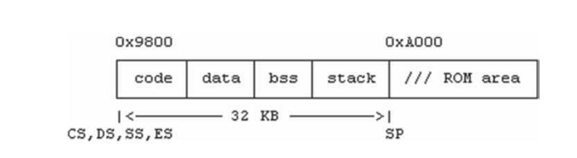

## 可启动设备

- 软驱
- 硬盘
- CD/DVD
- USB驱动


一个可启动设备包含一个引导程序和一个启动系统镜像，在启动时，BIOS加载引导程序的第一个512字节到内存中进行定位
（0x0000,0x7C00）=0x07C00，然后跳转到那里执行引导程序，之后，它会加载整个引导程序，

BIOS总是加载引导程序到0x07C00是历史遗留问题，早期的pc只有64KB内存，内存低于0x07C00作为中断向量保留，第一个操作系统可用内存地址开始于0x08000，所以引导程序被加载到0x07C00，将近1KB的地方，
当执行开始，引导程序典型动作如下：

- 加载引导程序剩余部分到内存中并执行完成引导程序
- 找到并加载操作系统镜像到内存中
- 让cpu执行操作系统内核起始代码，以启动操作系统

## 从可用设备引导
### 软驱引导

可以通过以下步骤创建单一软驱FD:

- 格式化软驱为EXT2文件系统格式：mke2fs 
- 挂载FD并创建目录：bin,boot,dev,lib,etc,sbin,usr
- 用linux内核需要的文件填充文件系统
- 放置一个linux zImage 到/boot目录下：rootdev=(2,0)
- 安装linux引导程序到FD的block0里


### 硬盘引导


### CD/DVD_ROM引导
### USB驱动引导

### 使用初始化内存镜像引导linux

### 网络引导

## 开发引导程序
### 引导程序要求

- 引导程序需要汇编代码
- 编译链接程序bcc(16位代码)，gcc(32或64位代码)
- 在执行期间，cpu的CS,DS,SS寄存器必须全部指向程序中的同一个段
- 引导程序大小极其受限，512或1024字节，为了能匹配磁盘的一个或两个扇区
    - 引导程序的第一个512字节被加载到0x07C00
    - 如果引导程序大于512字节，它必须自己加载缺失的部分
    - 如果引导程序的内存首部也是操作系统需要的，则必须将其移动到其他位置，以便其不被传入的操作系统镜像破坏
    - 引导程序必须管理自己的执行环节，如：建立cpu段寄存器和建立一个栈

- 引导程序不能用标准I/O库函数，如果需要使用，则需要自己实现
- 开发引导程序几乎没有工具可调试，如果出错，机器将简单宕机


### 在线和离线引导程序

#### 从FD扇区引导系统
FD磁盘包含一个引导程序在0扇区，紧接着是操作系统内核镜像，

```
as86 -o bs.o bs.s
bcc -c -ansi bc.c
#link bs.o and bc.o into a binary executable without header
ld86 -d -o booter bs.o bc.o /usr/lib/bcc/libc.a
# dump booter to sector 0 of a FD
dd if=booter of=/dev/fd0 bs=512 count=1 conv=notrunc
```
- if=输入
- of输出
- conv=notrunc 为了防止dd截断镜像文件

当然也可以将上述命令写入shell脚本中，或者Makefile文件中进行自动构建

以下为引导文件booter的汇编代码，bs.s
```assembler
!============================ bs.s file ================================
.globl _main,prints,_NSEC                       ! IMPORT from C
.globl _getc,putc,_readfd,_setes,inces,_error   ! EXPORT to C
    BOOTSEG     = 0x9800    ! booter segment
    OSSEG       = 0x1000    ! jfos kernel segment
    SSP         = 32*1024   ! booter stack size=32KB
    BSECTORS    = 2         ! number of sectors to load initially
! Boot SECTOR loaded at (0000:7C00). reload booter to segment 0x9800
start:
    mov     ax, #BOOTSEG    ! set ES to 0x9800
    mov     es, ax
! call BIOS INT13 to load BSECTORS to (segment,offset)=(0x9800,0)
    xor     dx, dx          ! dh=head=0, dl=drive=0
    xor     cx, cx          ! ch=cyl=0, cl=sector=0
    incb    cl              ! sector=1 (BIOS counts sector from 1)
    xor     bx, bx          ! (ES,BX)= real address = (0x9800,0)
    movb    ah, #2          ! ah=READ
    movb    al, #BSECTORS   ! al=number of sectors to load
    int     0x13            ! call BIOS disk I/O function
! far jump to (0x9800,next) to continue execution there
    jmpi    next, BOOTSEG   ! CS=BOOTSEG, IP=next
next:
    mov     ax, cs          ! Set CPU segment registers to 0x9800
    mov     ds, ax          ! we know ES=CS=0x9800. Let DS=CS
    mov     ss, ax          ! let SS=CS
    mov     sp, #SSP        ! SP = SS + 32KB
    call    _main           ! call main() in C
    jmpi    0, OSSEG        ! jump to execute OS kernel at (OSSEG,0)
!============================ I/O functions ==============================
_getc: ! char getc(): return an input char
    xorb    ah, ah          ! clear ah
    int     0x16            ! call BIOS to get char in AX 
    ret
_putc: ! putc(char c): print a char
    push    bp
    mov     bp, sp
    movb    al, 4[bp]       ! aL = char
    movb    ah, #14         ! aH = 14
    int     0x10            ! call BIOS to display the char
    pop     bp
    ret
_readfd: ! readfd(cyl, head, sector): load _NSEC sectors to (ES,0)
    push    bp
    mov     bp, sp          ! bp = stack frame pointer
    movb    dl, #0x00       ! drive=0 = FD0
    movb    dh, 6[bp]       ! head
    movb    cl, 8[bp]       ! sector
    incb    cl              ! inc sector by 1 too suit BIOS
    movb    ch, 4[bp]       ! cyl
    xor     bx, bx          ! BX=0
    movb    ah, #0x02       ! READ
    movb    al, _NSEC       ! read _NSEC sectors to (ES,BX)
    int     0x13            ! call BIOS to read disk sectors
    jb      _error          ! error if CarryBit is set
    pop     bp
    ret
_setes:                     ! setes(segment): set ES to a segment
    push    bp
    mov     bp, sp
    mov     ax, 4[bp]
    mov     es, ax
    pop     bp
    ret
_inces: ! inces(): increment ES by _NSEC sectors (in 16-byte clicks)
    mov     bx, _NSEC       ! get _NSEC in BX
    shl     bx, #5          ! multiply by 2**5 = 32
    mov     ax, es          ! current ES
    add     ax, bx          !  add(_NSEC*0x20)
    mov     es, ax          ! update ES
    ret
_error:
    push    #msg
    call    _prints
    int     0x19            ! reboot
msg:    .asciz "Error"

```
在上面的汇编代码中，start: 是引导程序的入口，在引导期间，BIOS加载引导磁盘的0扇区到(0x0000, 0x7C00),
并跳转到那里执行引导程序。我们假设引导程序必须重定向到一个不同的内存区域，相对移动引导程序，
代码中调用BIOS INT13中断去加载第2个扇区到0x9800段地址，FD驱动硬件可以加载
一次包含18个扇区的完整轨迹。加载2个（或更多）扇区的原因
很快就会明朗。在将引导程序加载到新段之后，它将执行一个远跳转，jmpi next, 0x9800，
它设置CPU的(CS, IP)=(0x9800,next)，导致
CPU从段0x9800中偏移next后继续执行。选择0x9800基于一个简单的原则：引导程序应该重新定位到一个高的位置，
以便留下尽可能多的低内存区域用于加载操作系统映像。段0x9800低于
从0xA000段开始的32 KB的ROM区域。这给引导程序一个32KB的空间
地址空间，这对于一个相当强大的引导程序来说足够大了。继续执行时
，ES和CS都已指向0x9800。汇编代码集 DS和 SS 也为了符合一个段内存的模型
程序。然后它将堆栈指针设置为高于SS的32kb。图3.8显示了
引导程序的运行时内存映像


 在一些PC机上，高于0X9F000的地址可能是为BIOS特殊用途而保留的，在这些机器上，栈指针可以设置到一个低内存地址，
如从SS段开始的16 KB，只要引导程序仍然有足够bss和栈空间，对于一个栈，程序可能开始用于调用，如，main()函数调用，
当main()函数返回时，它将发送给cpu执行加载系统镜像于(0x1000,0)

剩余的汇编代码包含了I/O函数和加载磁盘扇区，getc()函数和put(c)很简单，getc()返回一个从键盘输入的字符，
put(c)展示一个字符到屏幕上，readfd()，setes()和inces()函数则更多内容，为了加载系统镜像，引导程序必须能加载磁盘扇区
到内存中. BIOS通过INT13支持磁盘I/O函数，加载参数到cpu寄存器中。



readfd(cyl,head,sector)函数调用BIOS INT13中断加载NSEC扇区到内存中，NSEC是全局导入的C代码.
零计数参数，(cyl,head,sector)，被C代码计算，从BIOS统计第1个扇区开始，扇区值是一直自增的知道符合BIOS,
当加载磁盘扇区时，BIOS用(ES,BX)作为真实内存地址，从BX=0开始，加载地址是(ES,0)，因此，ES必须被设置，通过setes(segment)函数，
理想情况是在readfd调用之前加载段，该函数代码加载参数到cpu寄存器中，并调用INT 0X13中断，在加载了NSEC扇区之后，
又用inces()函数增加ES通过NESC扇区到加载下一个NSEC扇区，等。

error()函数被用于设置引导期间的任何错误，其打印错误信息，之后将重启。
使用NSEC作为全局变量而不是readfd()的参数
有两个用途。首先，它说明了在汇编和C代码之间全局变量的交叉引用
。第二，如果一个值不经常改变，它
不应该作为参数传递，因为这样做会增加代码大小。因为
引导程序的大小限制为512字节，即使节省几个字节也会影响成功与失败。接下来，我们展示引导程序的C代码。

```c
/**************************** jfos booter's bc.c file **********************
 FD contains this booter in Sector 0, jfos kernel begins in Sector 1
 In the jfos kernel: word#1=tsize in clicks, word#2=dsize in bytes
****************************************************************************/

int tsize, dsize, ksectors, i, NSEC = 1;

int prints(char *s) { while(*s) putc(*s++); }

int getsector(u16 sector)
{
    readfd(sector/36, ((sector)%36)/18, (((sector)%36)%18));
}

main()
{
    prints("booting jfos\n\r");
    tsize = *(int*)(512+2);
    dsize = *(int*)(512+4);
    ksectors = ((tsize<<4) + dsize + 511)/512;
    setes(0x1000);
    for(i=1; i<=ksectors; i++){
        getsector(i);
        inces();
        putc('.');
    }
    prints("\n\rready to go?");
    getc();
}

```

磁盘扇区是线性增长的编号，如0,1,2,....,但是BIOS INT13只在(cyl,head,sector)里接受磁盘参数，或CHS格式。
当调用BIOS INT13时，我们必须转换开始磁盘编号为CHS格式。如下图所示为FD扇区CHS寻址与线性的关系。

利用Mailman算法，我们可以把一个线性扇区编号转换成CHS
格式为cyl=sec/36；head=（sec%36）/18；扇区=（sec%36）%18；

然后在C中的getsector()函数中写入，其将调用readfd()进行磁盘扇区的加载。


